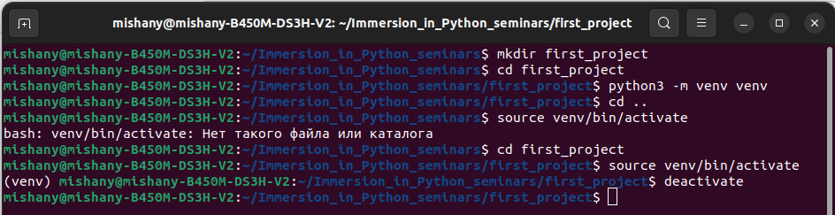
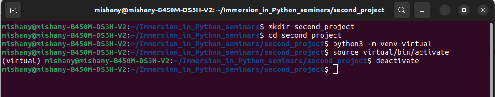
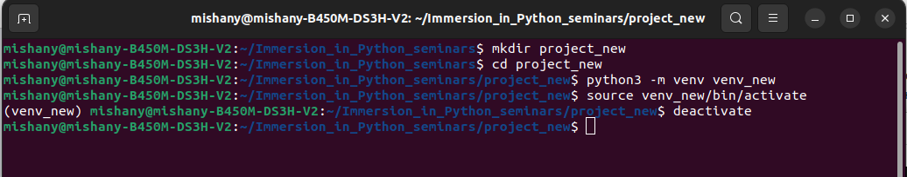
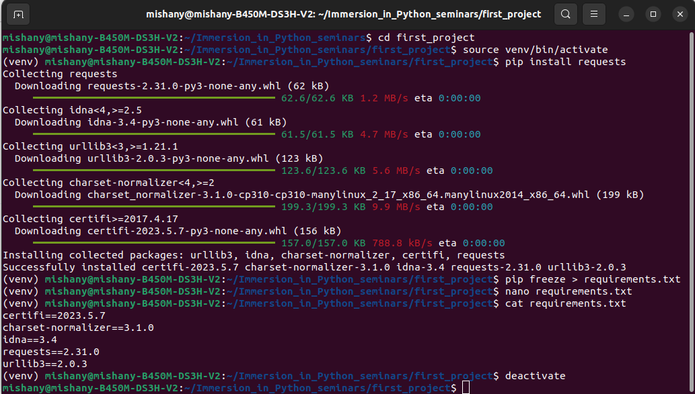
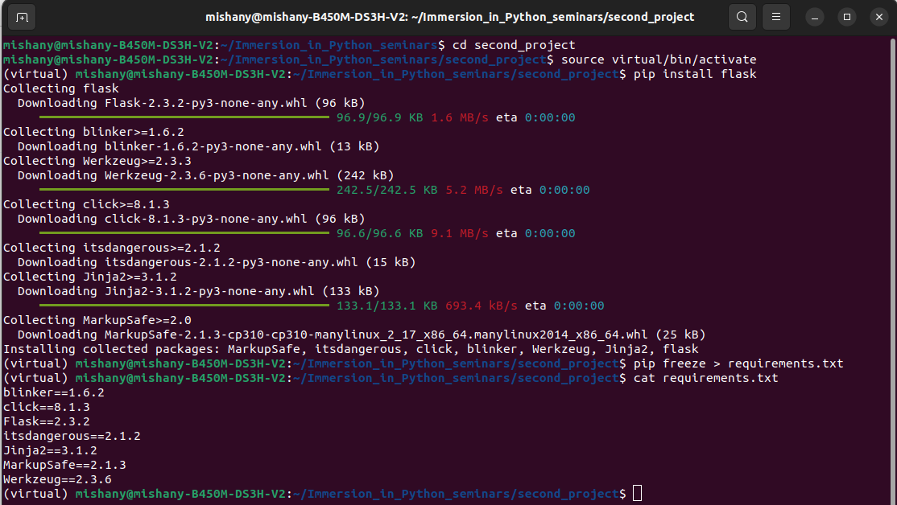
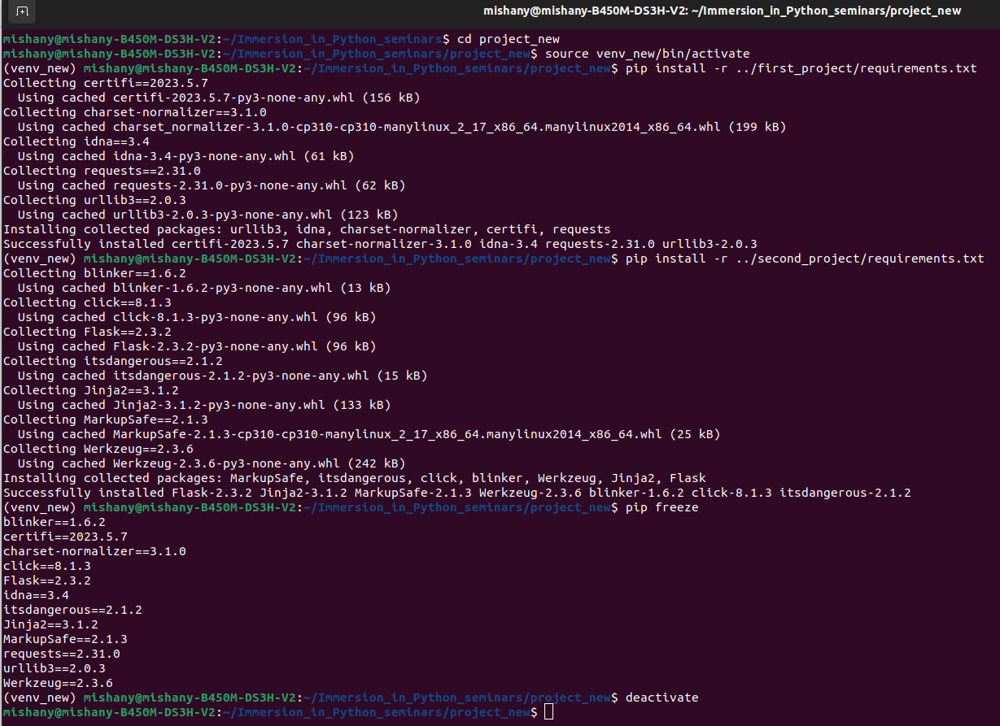
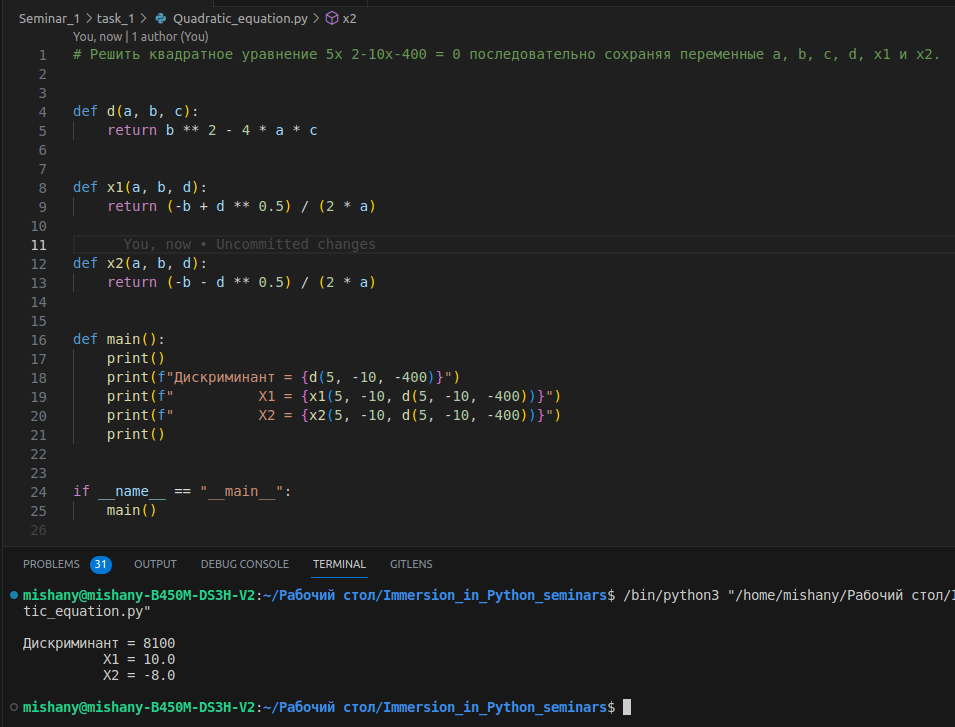
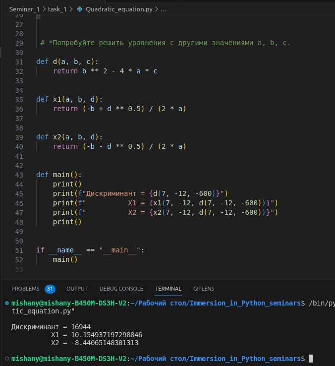

# Задание № 1
___
## 📌 Работаем в командной строке (терминале ОС)
___
## 📌 Создайте каталог для проекта first_project и разверните виртуальное окружение Python в папке venv внутри каталога

___
## 📌 Создайте каталог для проекта second_project и разверните виртуальное окружение Python в папке virtual внутри каталога

___
## 📌 Создайте третий каталог проекта project_new и разверните виртуальное окружение Python в папке venv_new внутри каталога

___
## 📌 Для каждого проекта последовательно активируйте и деактивируйте виртуальное окружение
___
___

# Задание № 2
___
## 📌 Активируем виртуальное окружение первого из трёх созданных проектов и устанавливаем в него модуль requests используя pip
___
## 📌 Проверяем установку выводом списка модулей в консоль
___
## 📌 Сохраняем список в файл, проверяем результат и выходим из окружения

___

## 📌 Активируем виртуальное окружение второго из трёх созданных проектов и устанавливаем в него модуль flask используя pip
___

## 📌 Проверяем установку выводом списка модулей в консоль
___

## 📌 Сохраняем список в файл и выходим из окружения

___

## 📌 Активируем третье виртуальное окружение
___

## 📌 Устанавливаем в него модули из первого и второго проекта используя ранее сохранённые в файлы списки модулей

___

## 📌 Проверяем установку выводом списка модулей в консоль
___
___

# Задание № 3
___
## 📌 Работа в консоли в режиме интерпретатора Python.
___
## 📌 Решите квадратное уравнение 5x 2-10x-400=0 последовательно сохраняя переменные a, b, c, d, x1 и x2.

___
## 📌 *Попробуйте решить уравнения с другими значениями a, b, c.

___
___