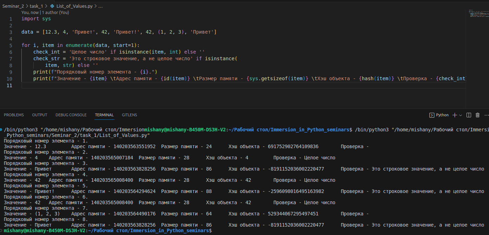

# Задание №1
___
## 1. Создайте несколько переменных разных типов.
___
## 2. Проверьте к какому типу относятся созданные переменные.

___
___

# Задание №2
___

## Создайте в переменной data список значений разных типов перечислив их через запятую внутри квадратных скобок. Для каждого элемента в цикле выведите:
___
### ✔ порядковый номер начиная с единицы
___
### ✔ значение
___
### ✔ адрес в памяти
___
### ✔ размер в памяти
___
### ✔ хэш объекта
___
### ✔ результат проверки на целое число только если он положительный
___
### ✔ результат проверки на строку только если он положительный
___
### Добавьте в список повторяющиеся элементы и сравните на результаты.

___
___

# Задание №3
___
## ✔ Напишите программу, которая получает целое число и возвращает его двоичное, восьмеричное строковое представление.
___
## ✔ Функции bin и oct используйте для проверки своего результата, а не для решения.
___
## Дополнительно:
___
### ✔ Попробуйте избежать дублирования кода в преобразованиях к разным системам счисления
___
### ✔ Избегайте магических чисел
___
### ✔ Добавьте аннотацию типов где это возможно

___
___